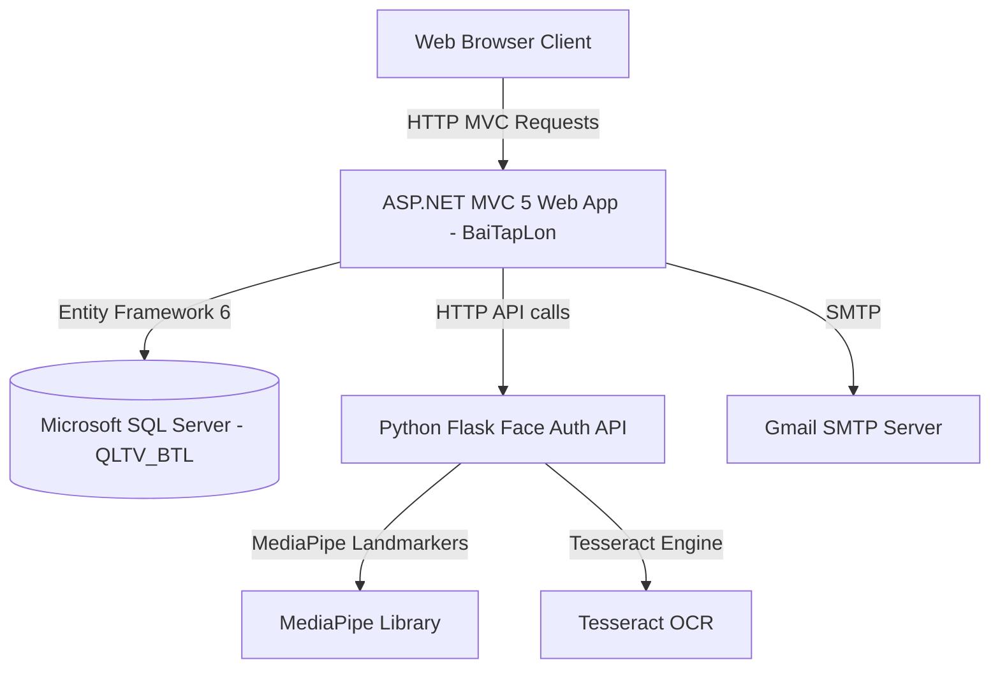

# 01. System Overview

This document provides a high-level system overview of the book store and rental management system (QLNhaSach).

## 1. Business Purpose
The primary business purpose of this system is to manage a physical and online bookstore that allows customers to:
1. Browse and purchase books online.
2. Rent books with strict identity verification.
3. Authenticate securely using a hybrid approach containing traditional credentials and Multi-Factor Authentication (MFA) powered by facial recognition.
4. Verify physical store proximity via geofencing to allow location-based operations (like book pickup/return).
5. Track and log transactional operations, geofence events, and authentication attempts.

## 2. System Objectives
- **Secure Book Rental**: Mitigate risk of book loss and identity fraud by matching user face profile templates with government-issued IDs (CMND/CCCD) via OCR and face verification.
- **Geographical Enforcement**: Limit certain features (like pick-up/return verification) using browser-based GPS geofence checks against physical store locations.
- **Automated Workflow**: Track rental periods, expected return dates, overdue flags, and notify users via automated emails.
- **Administrative Control**: Enable administrators to manage inventory, categories, rentals, user permissions, view logs, and configure store options.

## 3. Technology Stack & Frameworks
- **Web Portal**: ASP.NET MVC 5 (C#) targeting .NET Framework 4.8.
- **Data Access & ORM**: Entity Framework 6.1.3 (EF6) Code-First models and LINQ-to-Entities.
- **Main Relational Database**: Microsoft SQL Server (LocalDB / Express edition).
- **Face Auth & OCR API**: Python Flask API (`face_auth_api` version `1.0.0-v4`).
  - **Face Recognition**: MediaPipe (Task-based landmarker or FaceMesh solution) using Euclidean/Cosine-like distance comparison of face descriptors.
  - **OCR Engine**: Tesseract OCR (via Python wrapper `pytesseract`) to parse Vietnamese Identity Card details.
- **Mail Integration**: Standard SMTP (`System.Net.Mail` via `CommomSentMail` library).
- **Payment Providers**: Momo API and NganLuong API for online transactions.
- **Utilities**: BotDetect CAPTCHA (MVC implementation for spam prevention), `X.PagedList` for data pagination, and `ClosedXML` for Excel reporting.

## 4. Architectural Style
The project follows a **Layered N-Tier Architectural Style**:
1. **Presentation Layer (`BaiTapLon` Web MVC)**: Contains Controllers, Views, Models, and JavaScript interfaces for client interactions.
2. **Business & Data Access Layer (`Mood`)**: Houses Entity Framework DbContext (`QuanLySachDBContext`, `LogDbContext`), Code-First entities, repository-like query helpers (`Mood.Draw`), and ViewModels.
3. **Infrastructure & Shared Services (`Common` & `CommomSentMail`)**: Implements shared logging repositories (`LogRepository`) and email utility classes (`MailHelper`).
4. **External Services (`face_auth_api`)**: An independent Python Flask microservice providing API endpoints for specialized compute tasks (MediaPipe Face Verification, Tesseract OCR).

---

## 5. System Architecture Diagrams

### High-Level Architecture Diagram


### Component Diagram
```mermaid
component {
    [Web Client]
    [BaiTapLon.Controllers]
    [BaiTapLon.Services]
    [Mood.Draw DAOs]
    [Mood.EF2 Entities]
    [Common.Repositories]
    [CommomSentMail]
    [Flask face_auth_api]
    [SQL Server DB]
}
[Web Client] --> [BaiTapLon.Controllers]
[BaiTapLon.Controllers] --> [Mood.Draw DAOs]
[BaiTapLon.Controllers] --> [BaiTapLon.Services]
[BaiTapLon.Services] --> [Flask face_auth_api]
[BaiTapLon.Services] --> [CommomSentMail]
[Mood.Draw DAOs] --> [Mood.EF2 Entities]
[Mood.EF2 Entities] --> [SQL Server DB]
[Common.Repositories] --> [SQL Server DB]
[BaiTapLon.Controllers] --> [Common.Repositories]
```
