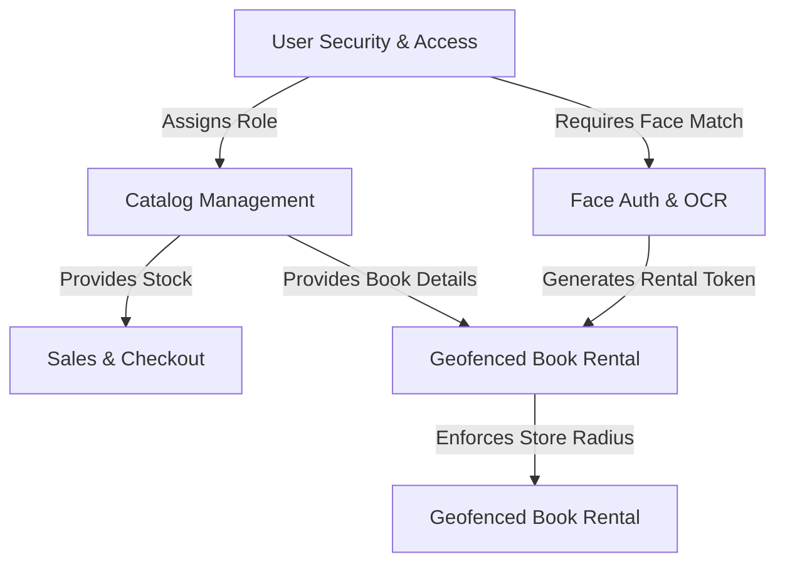

# 03. Business Modules

This document details the main functional modules of the bookstore system, describing their purpose, technical components, and dependencies.

---

## 1. Catalog & Product Management Module
- **Purpose**: Manages books, classifications, and stock status.
- **Responsibilities**:
  - Store book data: titles, authors, publishers, quantities, pricing (purchase price, sale price, promotional price), description text, digital preview files (PDF reviews), and YouTube trailer links.
  - Categorize books into hierarchical genre levels (using parent-child relationships).
- **Core Files**:
  - Entity Models: `Sanpham.cs`, `Category.cs`, `KhoHang.cs`
  - DAOs: `SanphamDraw.cs`, `CategoryDraw.cs`
  - Controllers:
    - User side: `ProductController.cs`
    - Admin side: `SanPhamController.cs`, `CategoryController.cs`
- **Database Tables**: `Sanpham`, `Category`, `KhoHang`
- **Dependencies**: Relies on User Security module for identity references during creation (`IDNguoiTao`).

---

## 2. Sales & Checkout Module
- **Purpose**: Provides cart operations and standard book purchases.
- **Responsibilities**:
  - Maintain session-based shopping cart (`CartSession`).
  - Calculate checkout totals, validate item quantity availability, and capture shipping details.
  - Track order progression (packaging, dispatching, cash-on-delivery or online payment, delivery statuses).
- **Core Files**:
  - Entity Models: `Orders.cs`, `Order_Detail.cs`
  - DAOs: `OrderDraw.cs`, `Order_DetailDraw.cs`
  - Controllers:
    - User side: `CartController.cs`
    - Admin side: `HoaDonController.cs`
- **Database Tables**: `Orders` (represented in EF as DbSet `Oders`), `Order_Detail` (DbSet `Oder_Details`)
- **Dependencies**: Checks stock counts in `Sanpham` before checkout completion. Relies on `CommomSentMail` to send transaction confirmations.

---

## 3. Face Authentication & OCR Module
- **Purpose**: Provides identity registration, secure facial validation, and document parsing.
- **Responsibilities**:
  - Capture and register profile photographs, exporting facial landmarks descriptors via Python's MediaPipe API.
  - Verify real-time face matches against registered user profiles with threshold check (minimum confidence defaults to `0.50` or `0.75`).
  - Parse national ID card uploads using OCR (Tesseract) to auto-fill registration fields and confirm document owner validity.
- **Core Files**:
  - Controllers: `FaceAuthController.cs` (MVC), `app.py` (Flask microservice)
  - Services: `FaceAuthApiClient.cs`, `FaceRentalTokenService.cs`
  - DB Table: `FaceAuthLogs` (managed by `LogRepository.cs`)
- **Dependencies**: Relies on file system uploads (`DataImage/FaceSamples`, `DataImage/IdentityCards/Drafts`). Integrates with the User Security module.

---

## 4. Geofenced Book Rental Module
- **Purpose**: Governs book lending cycles restricted to localized geographic boundaries.
- **Responsibilities**:
  - Restrict new rental checkout operations to clients physically situated near an active store location using browser geofence coordinates.
  - Require national ID uploads and face match validation prior to generating transient rental checkout tokens.
  - Track rental statuses: `Pending` -> `Approved` -> `Borrowing` -> `Returned`/`Rejected`/`Cancelled` or `Overdue`.
  - Adjust catalog inventory levels upon book pick-up (decrease stock) and check-in (increase stock).
- **Core Files**:
  - Entity Models: `RentalRequest.cs`, `StoreLocation.cs`
  - Services: `StoreLocationService.cs`, `FaceRentalTokenService.cs`, `GmailNotificationService.cs`
  - Controllers:
    - User side: `RentalController.cs`, `GeofenceController.cs`
    - Admin side: `RentalAdminController.cs`, `StoreLocationController.cs`
  - Audit logs: `RentalLogs` and `GeofenceLogs`
- **Database Tables**: `RentalRequests`, `StoreLocations`
- **Dependencies**: Deeply dependent on the Face Authentication module to issue verified tokens (`FaceRentalTokenService`) and the Catalog module to update warehouse numbers.

---

## 5. User Security & Access Control Module
- **Purpose**: Coordinates access controls, identity verification, roles, and profiles.
- **Responsibilities**:
  - Enforce user registration, input validation, and password hash storage (using MD5 encryption).
  - Enforce Multi-Factor Authentication (MFA) via face verification checks during system login if enabled.
  - Assign system roles via explicit IDs: `1` (Admin) and `2` (Customer / normal User).
- **Core Files**:
  - Entity Models: `User.cs`, `Quyen.cs`, `Feed_Back.cs`, `Contact.cs`
  - DAOs: `UserDraw.cs`, `Feed_BackDraw.cs`, `ContactDraw.cs`
  - Controllers:
    - User side: `UsersController.cs`, `ContactController.cs`, `AboutUsController.cs`
    - Admin side: `LoginController.cs`, `UserController.cs`, `FeedBackController.cs`
- **Database Tables**: `User` (DbSet `Users`), `Quyen` (DbSet `Quyens`), `Feed_Back` (DbSet `Feedbacks`), `Contact` (DbSet `Contacts`)
- **Dependencies**: Consumed by all administrative views (validating `AdminLogin` session tokens).

---

## Module Relationships Diagram

