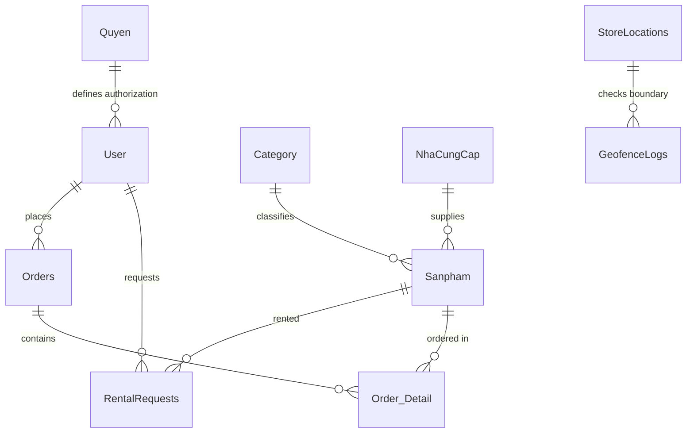

# 04. Database Analysis

This document details the database schemas, primary and foreign key structures, column validation parameters, and relationships within the bookstore and log databases.

---

## 1. Principal Database Tables (Domain & Transactional)

The primary database is configured via standard connection string `QuanLySachDBContext` on MS SQL Server (Catalog: `QLTV_BTL`).

### Table: `User`
Holds accounts details and identity templates.

| Column | Type | Nullable | Description / Key |
| :--- | :--- | :--- | :--- |
| `IDUser` | `bigint` | No | Primary Key (Identity) |
| `UserName` | `varchar(250)` | No | Unique Login Account |
| `PassWord` | `varchar(250)` | No | MD5 Enrypted Password Hash |
| `Name` | `nvarchar(250)` | No | Full Name |
| `Adress` | `nvarchar(250)` | No | Resident Address |
| `Email` | `varchar(250)` | No | Communication Email |
| `NotificationEmail` | `varchar(250)` | Yes | Alternate Email for alerts |
| `Phone` | `varchar(250)` | No | Mobile phone |
| `Status` | `bit` | No | Active/Locked status |
| `IDQuyen` | `bigint` | No | Foreign Key to `Quyen` (Logical) |
| `IdentityNumber` | `varchar(30)` | Yes | parsed CMND/CCCD number |
| `IdentityFullName` | `nvarchar(250)` | Yes | Name parsed from Card |
| `IdentityCardFrontImagePath` | `nvarchar(500)` | Yes | Storage path to front card photo |
| `IdentityCardBackImagePath` | `nvarchar(500)` | Yes | Storage path to back card photo |
| `IdentityVerifiedAt` | `datetime` | Yes | Verification timestamp |
| `IdentityFaceConfidence` | `float` | Yes | Match confidence score |

### Table: `Sanpham`
Stores book records.

| Column | Type | Nullable | Description / Key |
| :--- | :--- | :--- | :--- |
| `IDContent` | `bigint` | No | Primary Key (Identity) |
| `Name` | `nvarchar(250)` | No | Title of the book |
| `TacGia` | `nvarchar(50)` | No | Author |
| `NhaXuatBan` | `nvarchar(50)` | No | Publisher |
| `Soluong` | `int` | No | Initial Quantity |
| `Images` | `varchar(250)` | Yes | Cover Image URL path |
| `CategoryID` | `bigint` | Yes | Foreign Key to `Category` |
| `IDNCC` | `bigint` | Yes | Foreign Key to `NhaCungCap` |
| `GiaTien` | `int` | No | Selling Price |
| `GiaNhap` | `int` | Yes | Procurement Cost |
| `TonKho` | `int` | Yes | Remaining Stock count |
| `ReviewFilePath` | `varchar(500)` | Yes | Path to document preview PDF |

### Table: `RentalRequests`
Controls rentable items lifecycle and snapshot credentials.

| Column | Type | Nullable | Description / Key |
| :--- | :--- | :--- | :--- |
| `ID` | `int` | No | Primary Key (Identity) |
| `ProductID` | `bigint` | No | Foreign Key to `Sanpham` |
| `UserID` | `bigint` | No | Foreign Key to `User` |
| `Quantity` | `int` | No | Borrowed Amount |
| `Status` | `varchar(50)` | No | `Pending`, `Borrowing`, `Returned`, `Overdue` |
| `RequestedAt` | `datetime` | No | Time request entered |
| `BorrowDays` | `int` | No | Selected duration |
| `ExpectedReturnDate` | `datetime` | No | Due date |
| `ActualReturnDate` | `datetime` | Yes | Check-in date |
| `IdentityNumber` | `varchar(30)` | Yes | Tenant Card ID at check-out time |

### Table: `StoreLocations`
Defines active branches.

| Column | Type | Nullable | Description / Key |
| :--- | :--- | :--- | :--- |
| `ID` | `int` | No | Primary Key (Identity) |
| `StoreName` | `nvarchar(200)` | No | Branch Identifier |
| `Latitude` | `decimal(9,6)` | No | GPS Latitude coordinate |
| `Longitude` | `decimal(9,6)` | No | GPS Longitude coordinate |
| `GeofenceRadius` | `float` | No | Permitted checkout radius in km |

---

## 2. Audit Trail Database Tables (Separate Logging Context)

Configured under `LogDbContext` targeting connection string `DefaultConnection`. Created dynamically by `EnsureLogTables()` in `LogRepository.cs`.

### Table: `FaceAuthLogs`
Tracks all facial recognition events.

| Column | Type | Description / Key |
| :--- | :--- | :--- |
| `ID` | `int` | Primary Key (Identity) |
| `UserID` | `bigint` | Associated User ID |
| `Action` | `nvarchar(50)` | `Register`, `Verify`, `MFA`, `ActionChallenge` |
| `Timestamp` | `datetime2` | UTC Timestamp of event |
| `Result` | `bit` | Success/Failure status flag |
| `Confidence` | `float` | Score returned by face engine |
| `ErrorMessage` | `nvarchar(1000)` | Reason if authentication failed |

### Table: `GeofenceLogs`
Audits location-based checks.

| Column | Type | Description / Key |
| :--- | :--- | :--- |
| `ID` | `int` | Primary Key (Identity) |
| `UserID` | `bigint` | User ID initiating verify |
| `StoreID` | `int` | Target Branch ID |
| `IsInZone` | `bit` | Coordinate distance within limits |
| `Distance` | `float` | Computed distance in Kilometers |

---

## 3. Entity Relationship Diagram (ERD)

