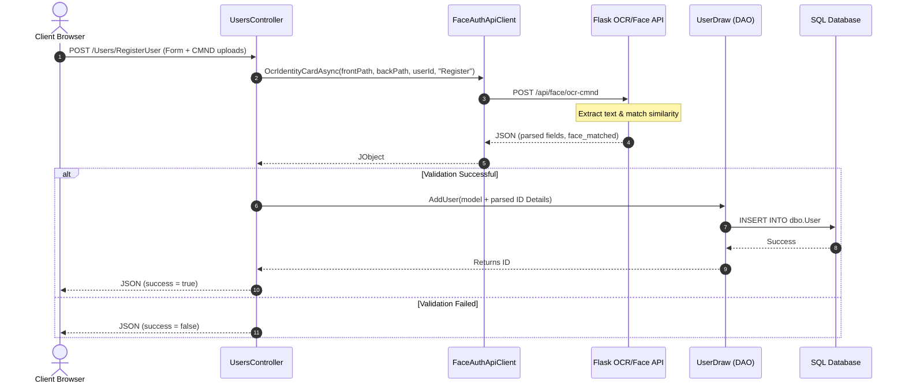
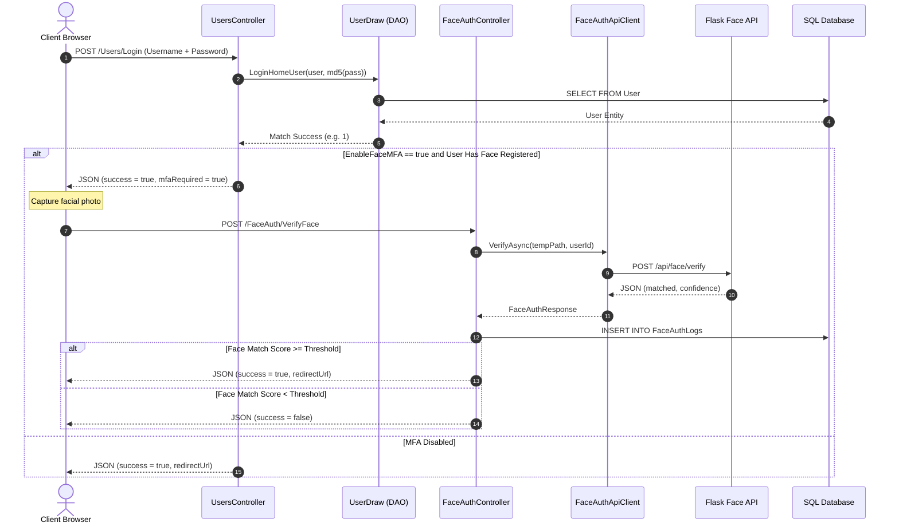
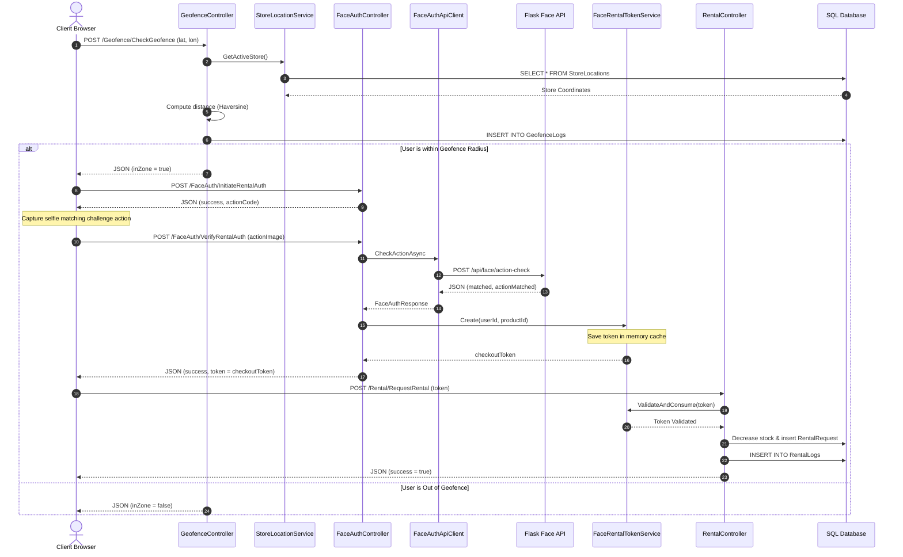

# 06. Request & Execution Flows

This document details the execution paths of major features with step-by-step descriptions and Sequence Diagrams.

---

## 1. User Registration & OCR ID Verification Flow

---

## 2. Login Flow with Face MFA Enforcement

---

## 3. Geofenced Book Rental & Liveness Verification Flow

