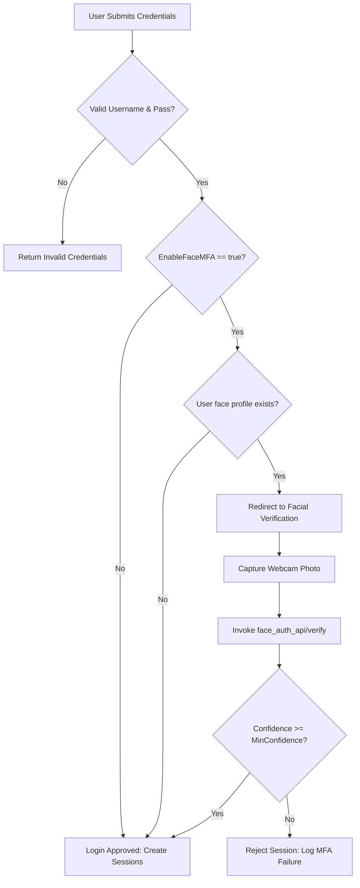

# 07. Authentication & Authorization

This document details the authentication procedures, credentials handling, session tracking, Multi-Factor Authentication (MFA), and administrative authorization controls.

---

## 1. Credentials Hashing & Verification
- **Hashing Algorithm**: MD5 is used to hash passwords before comparison (`EncryptorMD5.GetMD5(password)`).
- **Hardcoded Admin Credentials**: A fallback admin login exists in `UsersController.cs` for recovery purposes:
  - **Username**: `admin`
  - **Password**: `123456`
  - **Logic**: Evaluated via `IsFixedAdminLogin()`. If matched, registers a fixed session bypassing database checks.

---

## 2. Session-Based Authentication Lifecycle
The application does not rely on standard JWT tokens or FormsAuthentication cookies. Instead, it relies on standard ASP.NET `HttpSessionState` variables:
- **`Constant.USER_SESSION`**: Stores customer profiles (type `UserLogin`) to identify logged-in users.
- **`Constant.ADMIN_SESSION`**: Stores administrator credentials (type `AdminLogin`).
- **Authorization Filters**: The back-office administration panel controllers inherit from `BaseController`. It overrides `OnActionExecuting` to redirect incoming requests to `/Admin/Login/Index` if `Session[Constant.ADMIN_SESSION]` is null.

---

## 3. Multi-Factor Authentication (MFA) Flow via Facial Match
- **MFA Trigger**: Controlled by the `EnableFaceMFA` setting in `Web.config`.
- **Flow**:
  1. User enters username and password.
  2. If credentials match, the system checks whether a face profile exists for the user in `face_auth_api/face_profiles/[userId].json`.
  3. If found, the system holds the login session in a tentative state and redirects the user to `/FaceAuth/MfaLogin` to capture a face image.
  4. The captured photo is sent to `/FaceAuth/VerifyFace`, which delegates embedding similarity matching to the Flask API.
  5. Upon a match exceeding the confidence score threshold (defaulting to `0.50` or `0.75`), the system updates the session to authenticated and redirects the user to the homepage.

---

## 4. Authentication Flow Diagram

