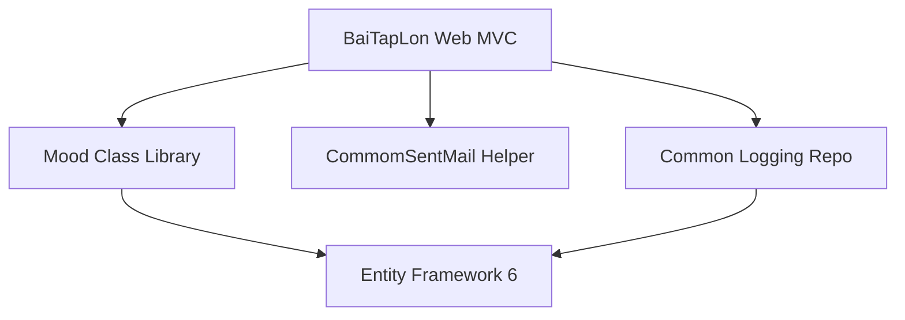

# 08. System Architecture

This document describes the architectural layout, package structure, and system interaction models.

---

## 1. High-Level Architecture
The system employs an **N-Tier Layered Architecture** pattern consisting of:
- **Presentation Layer**: Implements MVC (Model-View-Controller) structure where the client interacts with Razor views compiled by the ASP.NET MVC engine.
- **Service & Integration Layer**: Acts as a bridge between the core backend and outer systems (such as the Python Flask computer vision node and Gmail SMTP).
- **Data Access Layer**: Uses Entity Framework 6 (EF6) with dedicated DAO classes (`Mood.Draw`) to isolate EF querying logic from the presentation layer.
- **Domain Layer**: Houses Entity definitions (`Mood.EF2`) and DB Context configuration files.
- **Separate Infrastructure Logging**: Logging functions (`Common.Repositories`) write to a distinct database context (`LogDbContext`) to avoid locking or polluting domain models.

---

## 2. Package Dependency Diagram

---

## 3. Layer Interactions & Responsibilities

### Presentation Layer (`BaiTapLon`)
- **Controllers**: Intercept HTTP requests (GET/POST), parse parameter variables, evaluate view validation states, and invoke business service wrappers.
- **Views**: Razor templates compiling server variables into client-side HTML, CSS, and jQuery scripts.
- **ViewModels**: Standard transport wrappers capturing register details, log filters, and checkout fields.

### Services Layer (`BaiTapLon/Services`)
- **`FaceAuthApiClient`**: Formulates multipart HTTP POST payloads, establishes connection timeouts, and digests JSON results returned by the Flask API.
- **`FaceRentalTokenService`**: Evaluates checks, writing short-lived (default 3 minutes) tokens to `HttpRuntime.Cache` upon successful liveness checks.
- **`StoreLocationService`**: Retrieves geofence configurations from database repositories.

### Data Access Layer (`Mood/Draw` & `Mood/EF2`)
- **DbContexts**: Controls transaction sessions, DB connection channels, and entity mapping rules.
- **DAOs**: Executes LINQ-to-Entities filters, performs updates, deletes catalog items, and tracks sales logs.
- **Entities**: Defines tables schemas using attributes (e.g. `[Table("User")]`, `[Key]`, `[Required]`).
