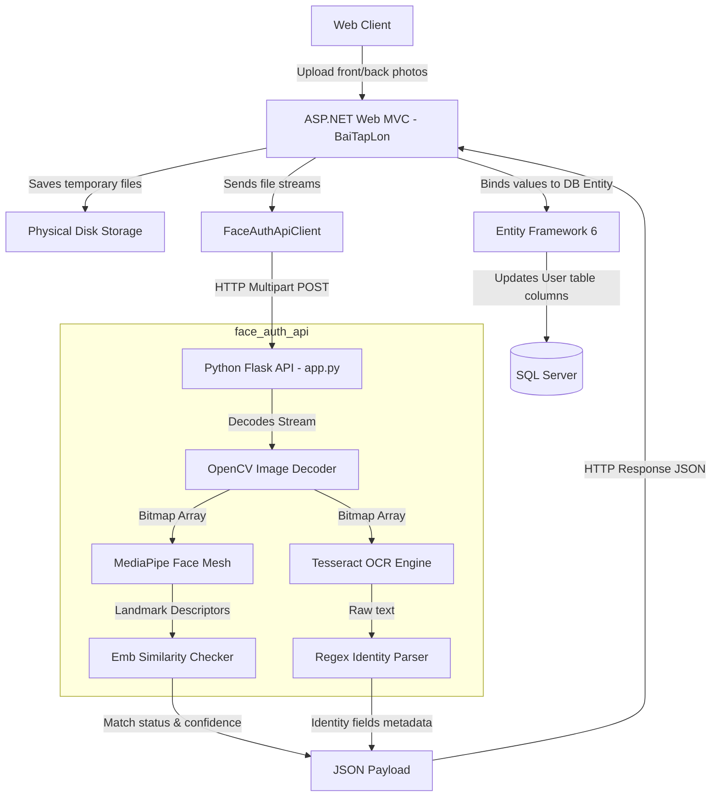

# 10. Data Flow

This document details the movement of data throughout the bookstore and authentication subsystems.

---

## 1. General Processing Paths

### Transactional checkout flow:
```text
Client Browser (HTML Form)
      ↓
Controller Action (CartController.Payment)
      ↓
Model Validation (Model Binding)
      ↓
DAO Query Verification (SanphamDraw - checks remaining stock)
      ↓
EF DBContext Mapping (QuanLySachDBContext - builds Orders and Order_Detail rows)
      ↓
SQL Server Database (Committed transaction rows)
      ↓
SMTP Dispatcher (Dispatches email alert to customer)
```

---

## 2. Facial Authentication and OCR Flow

The diagram below details the data flow of the Face Verification & OCR engine:



---

## 3. Data Transformation Formats
- **Form Data**: Captured from user registration forms or webcam capture scripts.
- **Multipart Form-Data**: Sent over HTTP from the Web App to the Flask server containing files (`file`, `front_file`, `back_file`) and metadata fields (`user_id`, `purpose`, `action_code`).
- **JSON Metadata**: Returned by the Flask server to C# Web services (containing confidence scores, match flags, character segments parsed from ID cards).
- **Relational Tables**: Stored inside MS SQL Server using corresponding database data types (e.g. `DateTime` fields mapped from OCR date formats, strings mapped from names).
