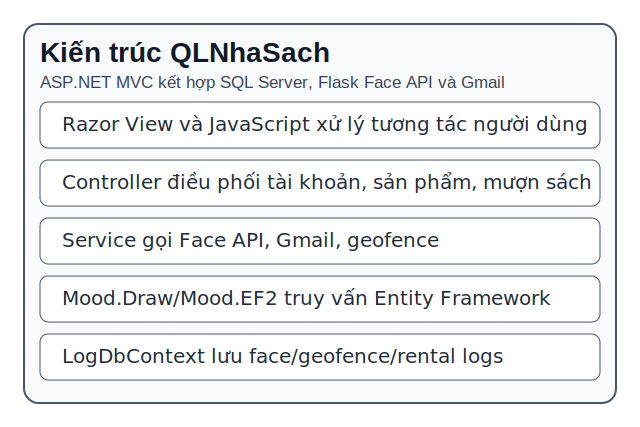
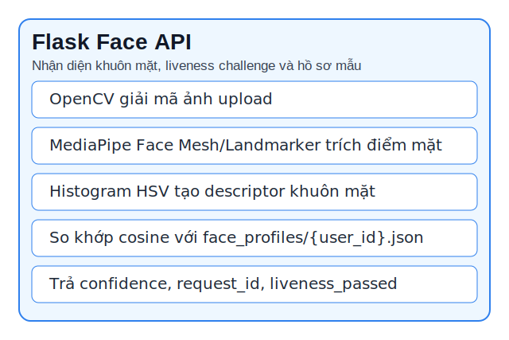
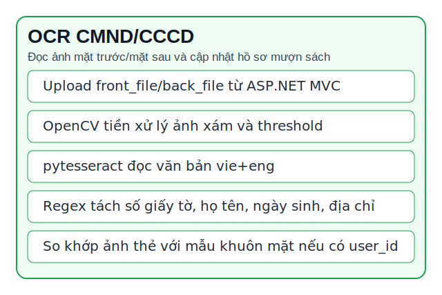
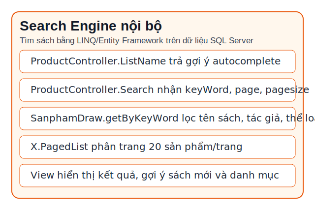

# Phân tích công nghệ nhận diện khuôn mặt, OCR CMND/CCCD và tìm kiếm

## 1. Kiến trúc tích hợp

Hệ thống QLNhaSach dùng ASP.NET MVC làm ứng dụng web chính. Các controller trong `BaiTapLon` xử lý request từ Razor View, sau đó gọi lớp nghiệp vụ trong `Mood.Draw`, `BaiTapLon.Services` và `Common.Repositories`. Dữ liệu chính được lưu qua Entity Framework trong `Mood.EF2.QuanLySachDBContext`, còn nhật ký xác thực/vị trí/mượn trả được lưu qua `LogDbContext`.

Thành phần Flask nằm trong `face_auth_api/app.py` được tách khỏi web MVC để xử lý tác vụ ảnh: nhận diện khuôn mặt, kiểm tra hành động sống và OCR CMND/CCCD. Web MVC gọi Flask qua `FaceAuthApiClient`, gửi multipart form-data gồm ảnh, `userId`, `purpose` và `actionCode` nếu có.

## 2. Flask Face API

Flask API cung cấp các route: `/api/face/health`, `/api/face/action-check`, `/api/face/register`, `/api/face/verify`, `/api/face/authenticate`, `/api/face/ocr-cmnd`, `/api/face/qcr-cmnd`, `/api/face/cmnd-ocr`.

Về xử lý ảnh, API dùng OpenCV để giải mã ảnh upload, chuyển màu và cắt vùng khuôn mặt. MediaPipe được dùng theo hai nhánh: `mp.solutions.face_mesh` nếu có sẵn, hoặc `mediapipe.tasks.python.vision.FaceLandmarker` nếu có model `models/face_landmarker.task`. Sau khi phát hiện điểm khuôn mặt, API tạo descriptor bằng histogram HSV của vùng mặt, lưu mẫu vào `face_profiles/{user_id}.json` khi đăng ký và so khớp bằng cosine similarity khi xác thực.

Liveness challenge được triển khai bằng cách ASP.NET MVC tạo token/chỉ dẫn trong session tại `FaceAuthController.CreateChallenge`. Người dùng thực hiện hành động như quay trái, quay phải, há miệng, cười, nhìn lên hoặc nhìn xuống. Flask API phân loại hành động qua yaw, pitch, nose offset, mouth open ratio và smile ratio tại `/api/face/action-check`.

## 3. OCR CMND/CCCD

Quy trình OCR bắt đầu tại `FaceAuthController.OcrCmndDraft` hoặc `FaceAuthController.OcrCmnd`. Controller nhận ảnh mặt trước/mặt sau bằng các field `front_file`, `back_file`, `frontFile`, `backFile`, lưu vào `DataImage/IdentityCards`, sau đó gọi `FaceAuthApiClient.OcrIdentityCardAsync`.

Ở Flask API, hàm `decode_identity_uploads` nhận một hoặc hai ảnh. Ảnh được xử lý xám, lọc bilateral, threshold Otsu rồi đưa vào `pytesseract.image_to_string` với ngôn ngữ mặc định `vie+eng`. Hàm `parse_identity_fields` tách các trường như số giấy tờ, họ tên, ngày sinh, giới tính, quốc tịch, quê quán, nơi thường trú, ngày cấp, nơi cấp và ngày hết hạn. Nếu có `user_id`, API còn cố so khớp ảnh mặt trên giấy tờ với mẫu khuôn mặt đã đăng ký.

Khi OCR thành công, ASP.NET MVC cập nhật các trường định danh trong `Mood.EF2.User`: `IdentityNumber`, `IdentityFullName`, `IdentityDateOfBirth`, `IdentityAddress`, `IdentityIssueDate`, `IdentityCardFrontImagePath`, `IdentityCardBackImagePath`, `IdentityFaceConfidence`, `IdentityVerifiedAt`. Đây là điều kiện quan trọng trước khi người dùng gửi yêu cầu mượn sách.

## 4. Search engine nội bộ

Dự án không dùng search engine ngoài như Elasticsearch. Phần tìm kiếm được triển khai nội bộ bằng ASP.NET MVC, Entity Framework/LINQ và SQL Server. `ProductController.ListName` phục vụ autocomplete tên sách, còn `ProductController.Search` nhận `keyWord`, `page`, `pagesize` rồi gọi `SanphamDraw.getByKeyWord`.

Cơ chế tìm kiếm dựa trên điều kiện `Contains` đối với các trường sách và thông tin liên quan như tên sách, tác giả, thể loại hoặc nhà cung cấp tùy hàm truy vấn. Kết quả được sắp xếp và phân trang bằng `X.PagedList`, mặc định 20 sản phẩm/trang. View tìm kiếm còn truyền thêm `listGoiY`, `Category`, `totalKq` và `keyWord` để hiển thị gợi ý, danh mục và số lượng kết quả.

Cách thiết kế này phù hợp quy mô đồ án vì tận dụng cơ sở dữ liệu sẵn có, không phát sinh hạ tầng mới, dễ giải thích trong báo cáo và dễ bảo trì. Hạn chế là khả năng xếp hạng theo độ liên quan, tìm kiếm không dấu và tìm kiếm toàn văn chưa mạnh như các search engine chuyên dụng.
