# UML Screen Navigation & Functionality Diagram (Version 2 - Optimized)

This document details the optimized User Interface (UI) Navigation Flow.

---

## 1. Full Screen Navigation Diagram (Optimized Flow)

```mermaid
flowchart TD
    %% Define Styles
    classDef default fill:#f9f9f9,stroke:#333,stroke-width:1px;
    classDef public fill:#e1f5fe,stroke:#0288d1,stroke-width:2px;
    classDef gate fill:#fff9c4,stroke:#fbc02d,stroke-width:2px;
    classDef customer fill:#e8f5e9,stroke:#388e3c,stroke-width:2px;
    classDef admin fill:#ffebee,stroke:#d32f2f,stroke-width:2px;

    %% Client Public Screens
    subgraph PortalPublic [Public Client Portal]
        Home["Trang Chủ (Home/Index)<br/>[Slides, Banners, Sách Hot]"]:::public
        Register["Trang Đăng Ký (Users/Register)"]:::public
        FaceEnroll["Đăng Ký Gương Mặt (FaceAuth/Enroll)"]:::public
        Login["Đăng Nhập (Users/Login)"]:::public
        BookDetail["Chi Tiết Sách (Product/Detail)"]:::public
        PdfViewer["Đọc Thử Sách PDF (Product/PdfViewer)"]:::public
        Cart["Giỏ Hàng (Cart/Index)"]:::public
        Checkout["Thanh Toán (Cart/Payment)"]:::public
        Contact["Liên Hệ & Gửi Phản Hồi (Contact/Index)"]:::public
    end

    %% Security Gateways
    subgraph Gateways [Identity Gateways]
        MfaLogin["Xác Thực Login MFA (FaceAuth/MfaLogin)"]:::gate
        RentalVerify["Liveness Mượn Sách (FaceAuth/RentalVerify)"]:::gate
    end

    %% Client Private Protected Screens
    subgraph PortalPrivate [Private Customer Portal]
        MyRentals["Lịch Sử Mượn Sách (Rental/MyRentals)"]:::customer
        Favorites["Sách Yêu Thích (Product/Favorites)"]:::customer
    end

    %% Admin Screens
    subgraph PortalAdmin [Admin Dashboard Panel]
        AdminLogin["Đăng Nhập Admin (Admin/Login)"]:::admin
        AdminHome["Dashboard Thống Kê (Admin/Home/Index)"]:::admin
        AdminUsers["Quản Lý User (Admin/User/Index)"]:::admin
        AdminBooks["Quản Lý Sách (Admin/SanPham/Index)"]:::admin
        AdminProcure["Quản Lý Nhập Hàng (Admin/NhapHang/Index)"]:::admin
        AdminNCC["Quản Lý Nhà Cung Cấp (Admin/NhaCungCap/Index)"]:::admin
        AdminCats["Quản Lý Thể Loại (Admin/Category/Index)"]:::admin
        AdminOrders["Quản Lý Đơn Hàng (Admin/HoaDon/Index)"]:::admin
        AdminRentals["Quản Lý Mượn Sách (Admin/RentalAdmin/Index)"]:::admin
        AdminStores["Quản Lý Geofence Chi Nhánh (Admin/StoreLocation/Index)"]:::admin
        AdminLogs["Nhật Ký Hệ Thống (Admin/LogsAdmin/Index)"]:::admin
        AdminReviews["Duyệt Bình Luận (Admin/ProductReview/Index)"]:::admin
        AdminFeedbacks["Quản Lý Phản Hồi (Admin/FeedBack/Index)"]:::admin
        AdminMarketing["Quản Lý Quảng Cáo (Admin/Slide/Index)"]:::admin
        AdminReports["Báo Cáo Thống Kê (Admin/ThongKe)"]:::admin
        AdminAiForecast["Dự Báo Kho AI (Admin/ThongKe/AiForecast)"]:::admin
    end

    %% Navigation Links / Transitions
    Home --> Register
    Home --> Login
    Home --> BookDetail
    Home --> Cart
    Home --> Contact
    Home --> Favorites

    Register -->|"OCR khớp mặt thẻ"| FaceEnroll
    FaceEnroll --> Login
    Login --> MfaLogin
    Login --> Home
    MfaLogin --> Home
    Cart --> Checkout
    Checkout --> Home
    BookDetail --> Cart
    BookDetail --> Favorites
    BookDetail --> PdfViewer
    BookDetail -->|"Yêu cầu GPS Geofence & Stock"| RentalVerify
    RentalVerify --> MyRentals
    MyRentals --> MyRentals

    AdminLogin --> AdminHome
    AdminHome --> AdminUsers
    AdminHome --> AdminBooks
    AdminHome --> AdminProcure
    AdminHome --> AdminNCC
    AdminHome --> AdminCats
    AdminHome --> AdminOrders
    AdminHome --> AdminRentals
    AdminHome --> AdminStores
    AdminHome --> AdminLogs
    AdminHome --> AdminReviews
    AdminHome --> AdminFeedbacks
    AdminHome --> AdminMarketing
    AdminHome --> AdminReports
    AdminHome --> AdminAiForecast

    Checkout --> AdminOrders
    RentalVerify --> AdminRentals
    MfaLogin --> AdminLogs
    Contact --> AdminFeedbacks
    BookDetail --> AdminReviews
```

---

## 2. Optimized UX & AI-Assisted Operations

### A. Customer PDF Viewer (Kendo-Like Native Reading)
- **Feature**: Reading preview book content (`ReviewFilePath`).
- **Implementation**: Instead of downloading the PDF file, the system routes users to a custom page incorporating **PDF.js** (by Mozilla) or **PDFObject**. It loads PDF file streams onto HTML5 canvas nodes, providing pagination, zooming, search, and page-turning transitions.

### B. Admin Reports & Statistics
- **Available Reports**:
  - **Revenue & Profit Tracking (`DoanhThuChart`)**: Visualizes sales and cost inputs using Chart.js, with Excel data export capabilities.
  - **Lending Metrics (`MuonTraChuDe`)**: Categorizes rental items (Pending, Borrowing, Returned, Overdue) by book themes/categories.
  - **Best Sellers (`ThongKeSanPhamHot`)**: Lists top-selling books.

### C. AI Integration for Smart Management
- **AI Inventory Forecasting (`AdminAiForecast`)**: Integrates Python Flask machine learning libraries (e.g., linear regression or Scikit-learn) with the database context. This module evaluates historical order data, rental duration points, and seasonal patterns to project future book demand, suggesting reorder dates.
- **LLM-Based Customer Support Widget (`ChatboxWidgetUrl`)**: Utilizes standard LLM chat APIs embedded inside the customer page footer, handling book searches, checking customer rental limits, and addressing common FAQs.
- **AI Fraud & Liveness Log Auditing**: Integrates with the Face & Geofence Logs to detect abnormal coordinate leaps or facial matching failure anomalies, alert-flagging potential identity spoofing attempts.

