# UML System Flow Diagram

This document contains a comprehensive UML Activity Diagram depicting the end-to-end logical flow of the entire system, from registration to login, geofencing, and book rental checkout.

---

## 1. Global System Activity Flow Diagram

This diagram shows how a user interacts with the system, highlighting the decision nodes for **Face MFA**, **Geofence Proximity validation**, **Action Challenge (Liveness)**, and administrative approval.

```mermaid
stateDiagram-v2
    [*] --> GuestVisitor
    
    state GuestVisitor {
        [*] --> Registration
        Registration --> OCR_Verification : Upload CMND/CCCD + Selfie
        state OCR_Verification {
            [*] --> Call_Flask_OCR
            Call_Flask_OCR --> Tesseract_Text_Extraction
            Tesseract_Text_Extraction --> Compare_Faces
            Compare_Faces --> Check_Result
        }
        
        OCR_Verification --> RegistrationSuccess : Identity Matches & Verified
        OCR_Verification --> RegistrationFail : Face mismatch or Bad OCR
        RegistrationFail --> Registration : Retry Upload
    }

    RegistrationSuccess --> UserLogin : Authenticate Credentials
    
    state UserLogin {
        [*] --> CheckMD5Password
        CheckMD5Password --> MFADecision : Password Matches?
        CheckMD5Password --> AccessDenied : No
        
        state MFADecision {
            [*] --> EvaluateMfaConfig
            EvaluateMfaConfig --> BypassMFA : EnableFaceMFA = false OR No Face Enrolled
            EvaluateMfaConfig --> RequestFaceMFA : EnableFaceMFA = true AND Face Enrolled
            
            RequestFaceMFA --> CaptureWebcamSelfie
            CaptureWebcamSelfie --> VerifyEmbeddingSimilarity : Call face_auth_api/verify
            VerifyEmbeddingSimilarity --> MFA_Success : Similarity >= Threshold
            VerifyEmbeddingSimilarity --> MFA_Fail : Similarity < Threshold
        }
    }
    
    AccessDenied --> UserLogin : Retry Credentials
    MFA_Fail --> UserLogin : Retry MFA / Block
    
    BypassMFA --> AuthenticatedSession
    MFA_Success --> AuthenticatedSession
    
    state AuthenticatedSession {
        [*] --> BrowseCatalog
        BrowseCatalog --> ViewBookDetail
        ViewBookDetail --> InitiateRental : Click "Rent Book"
        
        state GeofenceCheck {
            [*] --> ReadBrowserCoordinates
            ReadBrowserCoordinates --> CalculateDistance : Haversine Formula
            CalculateDistance --> EvaluateRadius : Compare against active StoreLocation radius
            EvaluateRadius --> InZone : Distance <= Radius
            EvaluateRadius --> OutOfZone : Distance > Radius
        }
        
        InitiateRental --> GeofenceCheck
        OutOfZone --> BlockRental : Display error "Too far from store"
        
        state RentalLivenessVerification {
            [*] --> GetRandomActionChallenge
            GetRandomActionChallenge --> PromptUser : Look Left / Smile / Open Mouth
            PromptUser --> CaptureActionSelfie
            CaptureActionSelfie --> Call_Flask_ActionCheck : Verify facial movement & similarity
            Call_Flask_ActionCheck --> LivenessApproved : Valid Action + Verified Face
            Call_Flask_ActionCheck --> LivenessRejected : Invalid Action / Impostor
        }
        
        InZone --> RentalLivenessVerification
        LivenessRejected --> BlockRental
        
        state CheckoutRental {
            [*] --> IssueTemporaryToken : Save to Cache (3 mins)
            IssueTemporaryToken --> RequestRentalWithToken
            RequestRentalWithToken --> ValidateAndConsumeToken
            ValidateAndConsumeToken --> DeductInventoryStock
            DeductInventoryStock --> SaveRentalRequest : Status = 'Pending'
            SaveRentalRequest --> SendGmailNotification
        }
        
        LivenessApproved --> CheckoutRental
        CheckoutRental --> RentRequestCreated
    }
    
    state AdminDashboard {
        [*] --> ReviewPendingRentals
        ReviewPendingRentals --> ApproveRequest : Click Approve
        ReviewPendingRentals --> RejectRequest : Click Reject
        
        ApproveRequest --> UpdateStatusBorrowing : Status = 'Borrowing'
        RejectRequest --> UpdateStatusRejected : Status = 'Rejected'
        
        UpdateStatusBorrowing --> CustomerReturnsBook : Physical check-in
        CustomerReturnsBook --> UpdateStatusReturned : Status = 'Returned'
        UpdateStatusReturned --> RestockInventory
    }
    
    RentRequestCreated --> AdminDashboard
    RestockInventory --> [*]
```

---

## 2. Diagram Component Explanations

1. **Guest Visitor**: Users register using their identity card (CMND/CCCD) and a selfie. The Python Flask API checks text parsing and facial similarity.
2. **User Login**: Multi-Factor Authentication (MFA) redirects the user to capture their face if configured, matching their features against the enrolled biometric profile.
3. **Geofence Check**: Ensures users are physically present within the coordinate perimeter of the active bookstore before they can initiate a rental.
4. **Rental Liveness Verification**: A challenge-response mechanism forces the user to perform an action (e.g., look left or smile) to verify they are a live person and matches their identity.
5. **Checkout Rental**: Generates a secure, temporary token in memory, deducts warehouse stock, and logs transactions.
6. **Admin Dashboard**: Enables admins to approve or reject rentals, update status to borrowing/returned, and restock inventory.
